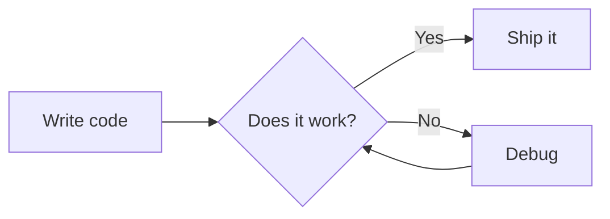

# MDViewer

A lightweight desktop Markdown viewer for macOS, built with C++ and wxWidgets. Renders Markdown files — including syntax-highlighted code, [Mermaid](https://mermaid.js.org) diagrams, and collapsible tidbits — entirely offline, with light and dark mode support.


## Features

- **Markdown rendering** — headings, bold, italic, strikethrough, inline code, links, images, blockquotes, ordered/unordered lists, tables, horizontal rules, hard line breaks
- **Syntax highlighting** — fenced code blocks highlighted by [highlight.js](https://highlightjs.org), supporting 180+ languages (cpp, python, js, rust, go, sql, …)
- **Mermaid diagrams** — flowcharts, sequence diagrams, class diagrams, Gantt charts, and more — rendered as SVG
- **Diagram zoom** — click any diagram for a full-screen view; scroll to zoom, drag to pan, ESC to close
- **Collapsible tidbits** — a `:::tidbit[Name]` extension for show/hide asides (see below)
- **Light / dark mode** — toggle via the View menu; preference is persisted between sessions
- **Adjustable font size** — increase, decrease, or reset via the View menu or keyboard shortcuts
- **Fully offline** — Mermaid.js and highlight.js are compiled into the binary at build time; no network required at runtime
- **LLM authoring support** — `mdviewer --llm` prints a syntax reference you can paste straight into an LLM context

## Dependencies

| Dependency | Version | Notes |
|---|---|---|
| [wxWidgets](https://wxwidgets.org) | 3.2+ | Core GUI + WebView + WebKit |
| CMake | 3.16+ | Build system |
| `xxd` | any | Ships with Vim / available on macOS |
| Internet (build only) | — | Auto-downloads `mermaid.min.js` and `highlight.js` once at configure time |

```bash
brew install wxwidgets
```

## Build

```bash
git clone https://github.com/your-username/mdviewer.git
cd mdviewer
cmake -B build && cmake --build build
```

On first configure, CMake downloads `mermaid.min.js` and `highlight.js` automatically and embeds them into the binary via `xxd`. All subsequent builds are fully offline.

### Install

```bash
sudo ln -s "$(pwd)/build/mdviewer" /usr/local/bin/mdviewer
```

## Usage

```bash
mdviewer <file.md>
mdviewer <file.html>
```

### Keyboard shortcuts

| Shortcut | Action |
|---|---|
| `Ctrl+O` | Open file |
| `Ctrl+R` | Reload current file |
| `Ctrl+Shift+L` | Light mode |
| `Ctrl+Shift+D` | Dark mode |
| `Ctrl++` | Increase font size |
| `Ctrl+-` | Decrease font size |
| `Ctrl+0` | Reset font size |
| `ESC` | Close diagram zoom |
| `Ctrl+Q` | Quit |

## Syntax

MDViewer renders standard Markdown. A few highlights:

### Code blocks with syntax highlighting

````markdown
```rust
fn main() {
    println!("Hello, world!");
}
```
````

Any language tag recognised by highlight.js works.

### Mermaid diagrams

````markdown

````

Click the rendered diagram to open the zoom modal.

### Tidbits — collapsible asides

Tidbits are a MDViewer extension for adding show/hide commentary alongside main content. They're designed for LLM-generated documents where you want entertaining or supplementary notes from a named voice that readers can reveal at their own pace.

```markdown
:::tidbit[Bjarne Stroustrup]
"I could have hidden vtables entirely. I chose not to —
the indirection *is* the point. You are welcome."
:::
```

This renders as a collapsed `<details>` widget labelled with the speaker's name. Click to reveal the content. No JavaScript required — it's a native HTML element.

**Rules:**
- Opening line: `:::tidbit[Speaker Name]`
- Closing line: `:::` (on its own line)
- Body supports any MDViewer markdown (paragraphs, bold, lists, code)
- Put a blank line before and after the block

## LLM authoring

MDViewer is designed to work well as an LLM output renderer. The `--llm` flag prints a complete syntax reference you can paste into any LLM context:

```bash
mdviewer --llm
```

This outputs a Markdown document covering every supported feature and the `:::tidbit` extension, so the LLM knows exactly what it can generate.

**Example workflow — ask Claude to write a C++ vtable explainer with tidbits:**

1. Run `mdviewer --llm` and paste the output into your prompt.
2. Ask the LLM to write a technical document and add `:::tidbit[Speaker]` sections between chapters with entertaining commentary from historical figures.
3. Open the resulting `.md` file in MDViewer. Read the chapter, then click the tidbits for a breather.

## Working with Claude Code

If you use [Claude Code](https://claude.ai/code), you can install a skill that gives any new Claude session a full briefing on this project — architecture, build commands, supported syntax, coding conventions, and the tidbit extension — so it can contribute immediately without re-reading the codebase from scratch.

### Install the skill

1. In Claude Code, run `/add-skill` (requires the [personal skills router](https://github.com/your-username/skills)).
2. Describe the skill: *"Read `/path/to/mdviewer-context.md` and brief me on the mdviewer project."*
3. In future sessions, type `/mdviewer-context` to load the briefing.

Or copy the skill definition from [`skill-definitions/mdviewer-context.md`](https://github.com/your-username/skills/blob/main/skill-definitions/mdviewer-context.md) if you already have a skills repo set up.

### What the skill covers

- Repo layout and module ownership rules
- Build and test commands
- The test-first workflow (`write a failing test before any implementation`)
- Every supported markdown feature and what is NOT supported
- The `:::tidbit` extension — syntax, rules, and implementation details
- The `--llm` flag and why it must run before the detach block
- C++ style rules from `CLAUDE.md`

## How it works

```
mdviewer file.md
    │
    ├─ RenderMarkdown()    hand-written block + inline parser → HTML body
    │                      handles :::tidbit blocks recursively
    │
    ├─ BuildHTML()         wraps body in a full HTML page:
    │     • inlines mermaid.min.js and highlight.js as <script> tags
    │     • applies CSS theme tokens (light / dark via custom properties)
    │     • adds zoom modal, font-size controls, tidbit <details> styles
    │
    └─ wxWebView::SetPage()  hands the HTML to an embedded WebKit engine
                             WebKit runs Mermaid, renders SVG diagrams
```

`mermaid.min.js` and `highlight.js` are never fetched at runtime. At build time, CMake runs `xxd -i` to convert each file into a C byte array compiled directly into the binary.

## Project structure

```
mdviewer/
├── src/
│   ├── markdown.h/cpp        — RenderMarkdown, ProcessInline, EscapeHTML, GetLLMReadme
│   ├── html_template.h/cpp   — BuildHTML (full HTML page, CSS, embedded JS)
│   ├── mdviewer.h/cpp        — MDViewerFrame, menus, file I/O, event handling
│   └── main.cpp              — entry point, --llm flag, posix_spawn detach
├── tests/
│   └── test_renderer.cpp     — unit tests (no wxWidgets dependency)
├── CMakeLists.txt
├── CLAUDE.md                 — coding conventions for Claude Code
└── sample.md                 — feature demo
```

## License

MIT
